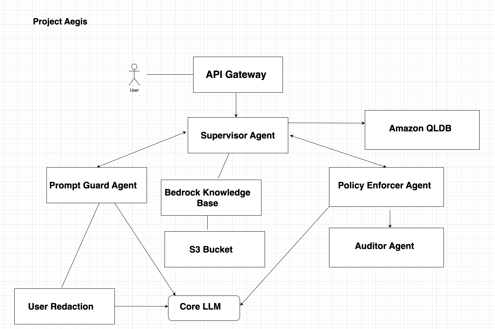

# Project Aegis

Project Aegis is a multi-agent AI co-pilot built on Amazon Bedrock that serves as an active defense system for enterprise AI. It transforms governance from a static checklist into a dynamic, intelligent, and adaptive framework, enabling enterprises to innovate with Generative AI safely, responsibly, and at scale.

## 🚀 About The Project
In today's enterprise environment, the adoption of Generative AI is often slowed by the significant risks of compliance failures, data privacy breaches, and ethical missteps. Project Aegis confronts this challenge head-on by providing a robust, automated solution to de-risk GenAI deployments.

The system intercepts user prompts and orchestrates a workflow between specialized AI agents to:

Redact sensitive PII in real-time.

Check user intent against regulatory documents (like GDPR) using Retrieval-Augmented Generation (RAG).

Provide a cryptographically verifiable, immutable audit trail of all interactions using Amazon QLDB.

Coach developers by providing clear, educational feedback when a request is blocked or modified.

Core Features
Dynamic Policy Enforcement: Uses an Amazon Bedrock Knowledge Base to check prompts against regulations like GDPR in real-time.

Automated PII Redaction: A PromptGuard agent automatically identifies and sanitizes sensitive data from user requests.

Immutable Audit Trail: A dedicated AuditLogger agent records every transaction to an Amazon QLDB ledger, ensuring a tamper-proof, verifiable log for compliance.

Educational Feedback: An Advisory agent provides clear explanations for why a prompt was modified or blocked, turning governance into a real-time coaching tool.

Serverless & Scalable: Built entirely on a modern, serverless AWS architecture for high scalability and operational efficiency.

🏗️ Architecture Overview
The system operates on a serverless, multi-agent architecture orchestrated by a central Supervisor Agent. All interactions are processed through a series of specialized AWS Lambda functions, with Amazon Bedrock providing the core intelligence and Amazon QLDB ensuring data integrity.

💻 Technology Stack
Category

Technologies

Frontend

Next.js 15, React 19, TypeScript, Tailwind CSS v4, shadcn/ui

Backend

Node.js (ES6), AWS Lambda

AI/ML

Amazon Bedrock, Knowledge Bases for Bedrock, Anthropic's Claude 3.5 Sonnet, Amazon Titan Text Lite, Amazon Titan Text Embeddings G1

AWS Services

Amazon API Gateway, Amazon S3, Amazon QLDB, Amazon DynamoDB, Amazon OpenSearch Serverless, AWS IAM

Databases

Amazon QLDB, Amazon DynamoDB

APIs

Amazon Bedrock API (RetrieveAndGenerate), Amazon QLDB API, AWS SDK for JavaScript v3

Tooling

pnpm, Git

🛠️ Getting Started
Follow these instructions to get a local copy of the project up and running for development and testing.

Prerequisites
An AWS Account with programmatic access and necessary permissions.

AWS CLI configured on your machine.

Node.js (v18 or later).

pnpm package manager.

1. Backend Setup (AWS Console)
The core infrastructure for the MVP must be provisioned manually in the AWS Management Console.

a. S3 Bucket for Knowledge Base
Navigate to the Amazon S3 console.

Create a new S3 bucket (e.g., project-aegis-regulatory-docs-2025). Keep "Block all public access" settings enabled.

Create a .txt file containing the plain text of GDPR Articles 5, 6, and 7.

Upload this file to the S3 bucket you just created.

b. Bedrock Knowledge Base
Navigate to the Amazon Bedrock console.

Go to Knowledge bases and click Create knowledge base.

Point the data source to the S3 bucket and .txt file created above.

When prompted, allow Bedrock to create a new IAM role.

For the embedding model, select Amazon Titan Text Embeddings G1.

Bedrock will automatically create an Amazon OpenSearch Serverless vector store.

Sync the data source. Note the Knowledge base ID after it's created.

c. QLDB Ledger
Navigate to the Amazon QLDB console.

Create a new ledger (e.g., aegis-audit-log).

Once the ledger is active, create an initial table named Interactions.

d. Lambda Functions & API Gateway
Navigate to the AWS Lambda console.

Create the following four Node.js 20.x Lambda functions:

Aegis-Supervisor-Agent

Aegis-PromptGuard-Agent

Aegis-PolicyEnforcer-Agent

Aegis-AuditLogger-Agent

Configure IAM roles for each function with the necessary permissions:

Supervisor: Needs permissions to invoke the other three Lambda functions.

PolicyEnforcer: Needs bedrock:RetrieveAndGenerate permission for the Knowledge Base you created.

AuditLogger: Needs permissions to write data to your QLDB ledger.

Navigate to the Amazon API Gateway console.

Create a new HTTP API.

Create a POST route (e.g., /prompt) and integrate it with the Aegis-Supervisor-Agent Lambda function.

Enable CORS for the endpoint to allow requests from your local development environment.

Note the Invoke URL for the API.

2. Frontend Setup (Local)
Clone the repository:

git clone https://github.com/mikoaro/project-aegis.git
cd project-aegis/frontend

Install dependencies:

pnpm install

Configure Environment Variables:
Create a .env.local file in the frontend directory by copying the example file:

cp .env.example .env.local

Update .env.local with your AWS configuration and the API Gateway Invoke URL:

NEXT_PUBLIC_API_GATEWAY_URL="https://h9zp1r5d13.execute-api.us-east-1.amazonaws.com/default/SupervisorAgent"
NEXT_PUBLIC_AWS_REGION="us-east-1"

Run the development server:

pnpm dev

Open http://localhost:3000 in your browser to see the application.

🎯 Usage
Once the application is running, you can test the core governance flows with the following scenarios:

Scenario 1: PII Redaction
Enter a prompt containing sensitive information. The system should process the request but return a response indicating that the PII was redacted.

Example Prompt:
"Analyze the following customer feedback and draft a personalized apology email to a user named John Doe who lives at 123 Main St and mentioned a billing issue with invoice #INV-456."

Scenario 2: Policy Enforcement (RAG)
Enter a prompt that would violate the ingested GDPR articles. The system should block the request and provide an explanation referencing GDPR.

Example Prompt:
"We have a dataset of customer feedback from our German user base. Use this to generate a new marketing campaign targeting these users with our latest product."

🗺️ Roadmap
The current implementation represents the Minimum Viable Product (MVP). Future development will focus on:

Expanded Agent Collective: Implementing the full 7-agent system, including a Pre-emptive Risk Assessor and Output Auditor.

Advanced UI/UX: Building out the full "Agent Trace" visualizer and a companion mobile app for compliance officers.

Multi-Modal Governance: Enhancing the PolicyEnforcer to analyze images and diagrams within documents.

Role-Based Access Control (RBAC): Integrating a user directory to enforce policies based on user roles.

📜 License
Distributed under the MIT License. See LICENSE for more information.